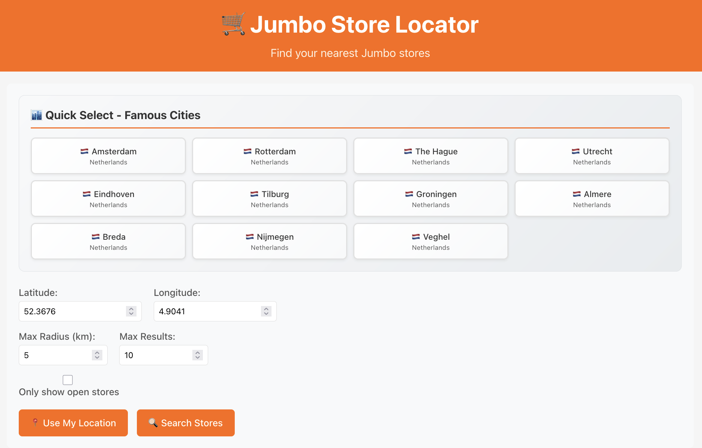
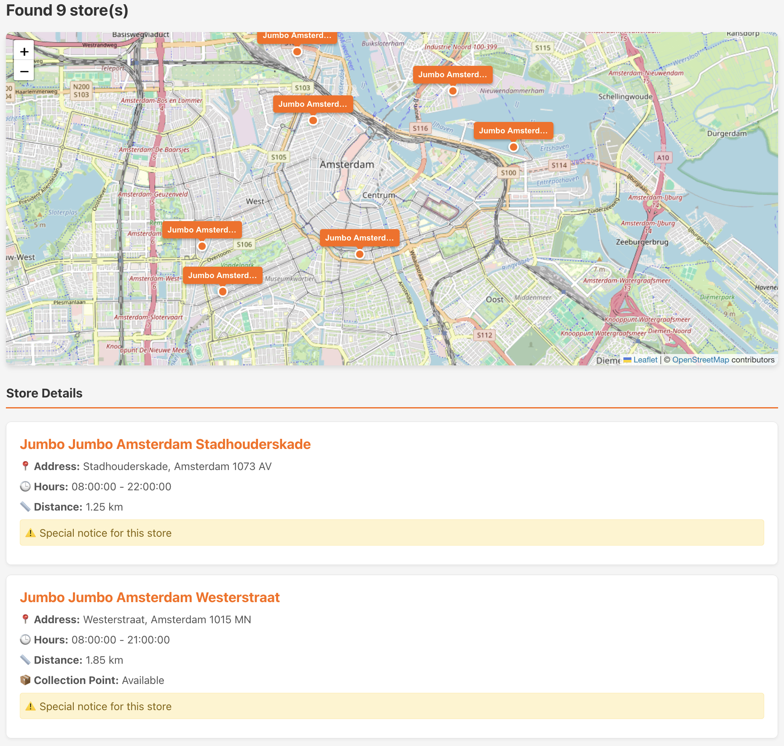

# Jumbo Store Locator

A microservice-based application for finding nearby Jumbo stores using geospatial search capabilities. The project implements hexagonal (ports and adapters) architecture and provides both REST API and web interface for store location services.

### Featured Cities Navigation & Filtering
<div align="center">
  
  <p><em>Quick navigation buttons for major Dutch cities (Amsterdam, Rotterdam, Utrecht, The Hague)</em></p>
</div>

### Interactive Map Features & Store Details
<div align="center">
  
  <p><em>Interactive map showing store markers, location details, and zoom controls</em></p>
</div>

## 🏗️ Architecture Overview

### Project Structure
```
jumbo/
├── location-service/          # Core store location microservice
├── store-locator-frontend/    # React-based web interface
├── config-server/            # Configuration management (not implemented yet)
├── name-server/              # Service discovery (not implemented yet)
└── docker-compose.yml        # Docker orchestration
```

### Hexagonal Architecture (Ports & Adapters)

The location service follows hexagonal architecture principles:

#### Core Domain
- **Domain Models**: `Store` entity with geospatial coordinates
- **Use Cases**: `NearByUseCase` interface defining business operations
- **Domain Services**: Distance calculation and spatial search algorithms

#### Ports (Interfaces)
- **Inbound Ports**: `NearByUseCase` - defines what the application can do
- **Outbound Ports**: `StoreRepository` - defines what the application needs

#### Adapters
- **Inbound Adapters**:
  - `StoreController` - REST API adapter
  - `HealthController` - Health check endpoint
- **Outbound Adapters**:
  - `StoreRepositoryImpl` - In-memory store data adapter

#### Search Strategies
The application supports multiple spatial search algorithms:
- **QuadTree**: Efficient spatial indexing for large datasets
- **In-Memory Linear**: Simple distance-based search
- Configurable via `JUMBO_LOCATION_SEARCH_STRATEGY` environment variable

## 🚀 Technology Stack

### Backend (Location Service)
- **Java 23** with Spring Boot 3.5.5
- **Spring Web** for REST API
- **Spring Validation** for request validation
- **Lombok** for boilerplate code reduction
- **MapStruct** for object mapping
- **SpringDoc OpenAPI** for API documentation
- **JTS Core** for geospatial operations
- **Logback** with JSON logging support

### Frontend (Store Locator)
- **React 18.2** with TypeScript
- **Leaflet** for interactive maps
- **React Leaflet** for React integration
- **Axios** for HTTP client
- **Nginx** for production serving

### Infrastructure
- **Docker & Docker Compose** for containerization
- **Maven** for build management
- **Spring Cloud** (prepared for microservices expansion)

### Core Features
1. **Geospatial Search**: Find nearby stores within specified radius
2. **Distance Calculation**: Haversine formula for accurate distance computation
3. **Filtering Options**:
   - Maximum search radius (1-100 km)
   - Result limit (1-50 stores)
   - Open stores only (based on current time)
4. **Interactive Map Features**:
   - Visual representation of store locations with markers
   - **Use My Location**: Automatic geolocation detection with user permission
   - **Dynamic Loading**: Real-time store loading when dragging and zooming the map
   - **Map Navigation**: Pan and zoom to explore different areas
   - Click on markers to view detailed store information
5. **Featured Cities**: Quick navigation to popular Dutch cities (Amsterdam, Rotterdam, Utrecht, The Hague)
6. **Responsive UI**: Works seamlessly on desktop and mobile devices
7. **Real-time Updates**: Automatic store refresh based on current map viewport

### API Endpoints
- `GET /api/v1/stores/nearby` - Find nearby stores
- `GET /api/v1/health` - Health check endpoint
- `GET /swagger-ui.html` - API documentation

### Query Parameters
- `latitude` (required): Location latitude (-90 to 90)
- `longitude` (required): Location longitude (-180 to 180)
- `maxRadius` (optional): Search radius in km (default: 5.0)
- `limit` (optional): Maximum results (default: 5)
- `onlyOpen` (optional): Filter open stores (default: false)

## 🐳 Running with Docker (Recommended)

### Prerequisites
- Docker Desktop installed
- Ports 3000 and 8080 available

### Quick Start
```bash
# Clone the repository
git clone <repository-url>
cd jumbo

# Start all services
docker-compose up

# Or start in background
docker-compose up -d
```

### Configuring Backend Address
When running with Docker, you can customize the backend API address that the frontend connects to:

#### Default Configuration
By default, the frontend is configured to connect to `http://localhost:8080/api/v1`

#### Custom Backend Address
To connect to a different backend (e.g., production server, different port, or remote instance):

```bash
# Option 1: Set environment variable before starting
export API_BASE_URL=http://your-backend-server:8080/api/v1
docker-compose up

# Option 2: Inline environment variable
API_BASE_URL=http://production-api.jumbo.com/api/v1 docker-compose up

# Option 3: Using docker-compose override
echo "version: '3.8'
services:
  store-locator-frontend:
    environment:
      - API_BASE_URL=http://your-custom-backend:8080/api/v1" > docker-compose.override.yml
docker-compose up
```

#### Common Backend Address Examples
```bash
# Local development with different port
API_BASE_URL=http://localhost:9090/api/v1 docker-compose up

# Remote development server
API_BASE_URL=http://dev-api.jumbo.com/api/v1 docker-compose up

# Production environment
API_BASE_URL=https://api.jumbo.com/api/v1 docker-compose up

# Different host (when backend runs on different machine)
API_BASE_URL=http://192.168.1.100:8080/api/v1 docker-compose up
```

### Access Applications
- **Frontend**: http://localhost:3000
- **Backend API**: http://localhost:8080/api/v1
- **API Documentation**: http://localhost:8080/swagger-ui.html

### Individual Service Management
```bash
# Start only backend
docker-compose up location-service

# Start only frontend (requires backend running)
docker-compose up store-locator-frontend

# View logs
docker-compose logs location-service
docker-compose logs store-locator-frontend

# Stop services
docker-compose down
```

## 💻 Running in IntelliJ IDEA

### Prerequisites
- **Java 23** installed
- **Node.js 16+** and npm installed
- **IntelliJ IDEA** with Maven support

### Backend Setup

1. **Import Project**:
   ```
   File → Open → Select jumbo/pom.xml → Open as Project
   ```

2. **Configure SDK**:
   ```
   File → Project Structure → Project → SDK → Select Java 23
   ```

3. **Run Location Service**:
   ```
   Navigate to: location-service/src/main/java/com/jumbo/LocationServiceApplication.java
   Right-click → Run 'LocationServiceApplication'
   ```
   
   Alternative run configurations:
   - **Main Class**: `com.jumbo.LocationServiceApplication`
   - **VM Options**: `-Dspring.profiles.active=dev`
   - **Environment Variables**: `JUMBO_LOCATION_SEARCH_STRATEGY=quadtree`

4. **Verify Backend**:
   - Service: http://localhost:8080/api/v1/health
   - Swagger: http://localhost:8080/swagger-ui.html

### Frontend Setup

1. **Open Terminal in IDEA**:
   ```bash
   cd store-locator-frontend
   npm install
   npm start
   ```

2. **Configure Environment** (optional):
   ```bash
   # Create .env file in store-locator-frontend/
   echo "REACT_APP_API_BASE_URL=http://localhost:8080/api/v1" > .env
   ```

3. **Verify Frontend**:
   - Application: http://localhost:3000

## 🔧 Configuration

### Environment Variables

#### Location Service
- `SPRING_PROFILES_ACTIVE`: Active Spring profiles (default: `default`)
- `JUMBO_LOCATION_SEARCH_STRATEGY`: Search algorithm (`quadtree` or `inmem`)
- `SERVER_PORT`: Service port (default: `8080`)

#### Frontend
- `API_BASE_URL`: Backend API base URL (default: `http://localhost:8080/api/v1`)
- `PORT`: Frontend port (default: `3000`)

### Application Configuration
Key configuration files:
- `location-service/src/main/resources/application.yaml`: Main backend config
- `location-service/src/main/resources/stores.json`: Store data
- `store-locator-frontend/public/env-config.js`: Frontend environment config

## 🧪 Testing

### Backend Tests
```bash
# Run all tests
cd location-service
mvn test

# Run specific test class
mvn test -Dtest=StoreControllerTest

# Integration tests
mvn test -Dtest=BusinessLogicIntegrationTest
```

### Test Coverage
- Unit tests for domain services
- Integration tests for API endpoints
- Repository implementation tests
- Validation tests for request parameters

## 📊 Monitoring & Observability

### Health Checks
- **Endpoint**: `GET /api/v1/health`
- **Docker**: Built-in health check with wget
- **Response**: JSON with service status

### Logging
- **Format**: JSON for production, console for development
- **Levels**: Configurable via application.yaml
- **Files**: Rotating logs in `logs/` directory

## 🚧 Future Development

### Services Not Yet Implemented

#### Config Server
- **Purpose**: Centralized configuration management
- **Technology**: Spring Cloud Config
- **Status**: Project structure created, implementation pending

#### Name Server (Service Registry)
- **Purpose**: Service discovery and registration
- **Technology**: Spring Cloud Netflix Eureka
- **Status**: Project structure created, implementation pending

### Planned Enhancements
- Database integration (PostgreSQL/Redis)
- Caching layer for improved performance
- Authentication and authorization
- Rate limiting and API throttling
- Advanced geospatial features (polygon search, routing)
- Mobile application support

## 🐛 Troubleshooting

### Common Issues

#### Port Conflicts
```bash
# Check port usage
lsof -i :8080
lsof -i :3000

# Kill processes if needed
kill -9 <PID>
```

#### Docker Issues
```bash
# Clean up Docker resources
docker-compose down -v
docker system prune -f

# Rebuild containers
docker-compose build --no-cache
```

#### Build Issues
```bash
# Clean Maven build
mvn clean install

# Clear npm cache
npm cache clean --force
```

### Debug Mode
```bash
# Backend with debug logging
java -jar -Dlogging.level.com.jumbo=DEBUG target/location-service-*.jar

# Frontend with verbose output
REACT_APP_DEBUG=true npm start
```

## 📚 API Documentation

Complete API documentation is available at:
- **Swagger UI**: http://localhost:8080/swagger-ui.html
- **OpenAPI Spec**: http://localhost:8080/v3/api-docs

The API follows RESTful principles with comprehensive validation and error handling.

## 🤝 Contributing

1. Fork the repository
2. Create feature branch (`git checkout -b feature/amazing-feature`)
3. Follow the existing code style and architecture patterns
4. Add tests for new functionality
5. Commit changes (`git commit -m 'Add amazing feature'`)
6. Push to branch (`git push origin feature/amazing-feature`)
7. Open a Pull Request

## 📄 License

This project is proprietary software developed for Jumbo Supermarkten.
